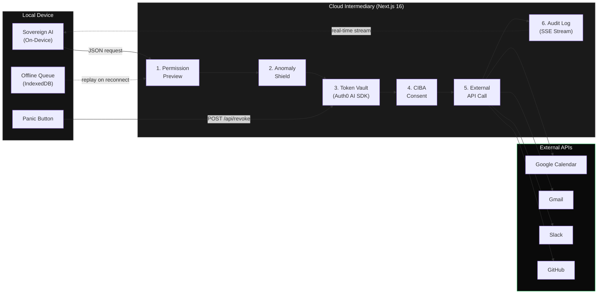
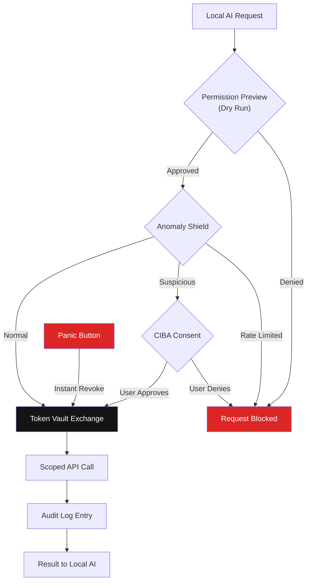

# ClawGuard

**Local AI that safely touches the world — with zero token exposure.**

Sovereign AI agent platform where core reasoning runs *locally* while a cloud intermediary securely handles external API access via **Auth0 Token Vault**. OAuth tokens never touch the local machine.

Sovereign AI agent platform. Five fail-safe layers. Auth0 Token Vault at the core.

---

## Why This Matters

An AI agent with your OAuth tokens is an AI agent with your identity. ClawGuard ensures your AI reasons locally, but acts through a zero-trust security pipeline — every external API call is scoped, audited, and revocable in under 2 seconds.

---

## Architecture



**Request flow:** Local prompt → Permission Preview (dry-run) → Queue if offline → Anomaly Shield check → Token Vault scoped exchange → Optional CIBA step-up → External API → Audit entry → Result streams back → One-click revoke available at any time.

---

## Features

| Feature | Description |
|---------|-------------|
| **Instant Revoke** | One-click bulk revocation of all Token Vault tokens. Severs agent access in <2s. |
| **Anomaly Shield** | Rate limiting, suspicious-hour detection, auto-CIBA step-up for high-risk actions. |
| **Offline Queue** | Requests queue locally during outages, replay through full Token Vault flow on reconnect. |
| **Permission Preview** | Dry-run mode validates scopes and shows risk level before any token exchange. |
| **Live Audit Trail** | Real-time SSE dashboard of every Token Vault exchange, CIBA consent, and revocation. |
| **CIBA Consent** | High-risk actions trigger backchannel push approval. Agent waits — can't bypass what it can't see. |
| **Attack Simulation** | Built-in red-team mode simulating token replay, scope escalation, rate limit breach. |
| **Token Lifecycle** | Visual birth-to-death flow: creation, scoping, use, refresh, and revocation. |

---

## Auth0 Deep Integration

ClawGuard uses **6 Auth0 products/features** — not surface-level, but architecturally central:

| Auth0 Feature | How ClawGuard Uses It |
|---|---|
| **Token Vault** (`Auth0AI.withTokenVault`) | Every external API call exchanges scoped tokens through Token Vault. The AI never sees raw OAuth tokens. Minimum-scope-per-tool-call pattern. |
| **CIBA** (`Auth0AI.withAsyncAuthorization`) | High-risk actions (delete, admin, transfers) and suspicious-hour activity trigger backchannel push notifications for user approval before execution. |
| **Management API** | Bulk token revocation (`DELETE /api/v2/users/{id}/federated-connections/{conn}/tokens`), connection health monitoring, and session management. |
| **Connections** | Multi-provider OAuth: Google (Calendar + Gmail), Slack, GitHub — each with independent scope management and revocation. |
| **NextJS SDK** (`@auth0/nextjs-auth0`) | Session management, middleware-based auth, server-side session validation on every API route. |
| **Scoped Access Patterns** | Per-tool minimum scopes: calendar tool gets only `calendar.events`, Gmail gets only `gmail.send` — never broad access. |

---

## Quick Start

```bash
git clone https://github.com/ashutosh887/ClawGuard.git
cd ClawGuard
npm install
cp .env.example .env.local
npm run dev
```

Open [http://localhost:3000](http://localhost:3000) to see the landing page. Navigate to `/chat` for the sovereign AI chat interface, or `/dashboard` for the real-time security operations view.

---

## Tech Stack

| Package | Version | Purpose |
|---|---|---|
| **Next.js** | 16.2.2 | App Router, Server Components |
| **@auth0/ai** | 6.0.0 | Token Vault, CIBA, Device Flow |
| **@auth0/ai-langchain** | 5.0.0 | LangChain bindings for Auth0 AI |
| **@auth0/nextjs-auth0** | 4.16.1 | Session management, middleware auth |
| **@langchain/langgraph** | 0.4.9 | Agent orchestration |

---

## Security Model



**Zero-trust principles:**
- Tokens never leave the server — `getAccessTokenFromTokenVault()` is server-side only
- Every exchange is audited in real-time via SSE
- Anomaly Shield gates every Token Vault exchange (rate limits + pattern detection)
- One-click revocation severs all agent access across all connections simultaneously
- CIBA step-up ensures high-risk actions require explicit human consent on a second device

---

## Project Structure

```
app/
├── api/
│   ├── tool-request/route.ts   # Main: local AI → cloud intermediary
│   ├── revoke/route.ts         # Instant bulk token revocation
│   ├── preview/route.ts        # Dry-run permission check
│   ├── audit/route.ts          # SSE real-time audit stream
│   ├── queue/route.ts          # Offline queue replay
│   └── simulate/route.ts       # Attack simulation engine
├── dashboard/page.tsx          # Security operations dashboard
├── chat/page.tsx               # Sovereign AI chat interface
├── layout.tsx                  # Root layout (Geist fonts, Nav)
└── page.tsx                    # Landing page
components/
├── audit-dashboard.tsx         # Real-time audit trail (SSE)
├── local-chat.tsx              # Chat UI with offline queue
├── permission-preview.tsx      # Dry-run permission card
├── revoke-button.tsx           # Kill All Tokens button
├── attack-simulator.tsx        # Red team simulation panel
├── token-lifecycle.tsx         # Token flow visualizer
├── status-card.tsx             # Dashboard status indicators
└── nav.tsx                     # Top navigation
lib/
├── auth0.ts                    # Auth0 client + management token
├── token-vault.ts              # Risk assessment + revocation
├── anomaly-shield.ts           # Rate limiting + pattern detection
├── audit-log.ts                # In-memory audit with SSE pub/sub
├── queue.ts                    # Server-side request queue
├── simulator.ts                # Attack simulation engine
├── utils.ts                    # cn() helper
└── langgraph/
    ├── agent.ts                # Auth0AI.withTokenVault() wrappers
    └── tools.ts                # LangChain tools (Calendar, Gmail, Slack)
```

---

## Environment Variables

Copy `.env.example` to `.env.local` and fill in your Auth0 credentials:

| Variable | Description |
|---|---|
| `AUTH0_SECRET` | Session encryption secret (generate with `openssl rand -hex 32`) |
| `AUTH0_BASE_URL` | Your app URL (e.g., `http://localhost:3000`) |
| `AUTH0_ISSUER_BASE_URL` | Auth0 tenant URL (e.g., `https://your-tenant.auth0.com`) |
| `AUTH0_CLIENT_ID` | Auth0 application client ID |
| `AUTH0_CLIENT_SECRET` | Auth0 application client secret |
| `AUTH0_DOMAIN` | Auth0 domain (e.g., `your-tenant.auth0.com`) |
| `AUTH0_AUDIENCE` | API audience identifier |
| `AUTH0_GOOGLE_CONNECTION` | Google OAuth2 connection name |
| `AUTH0_SLACK_CONNECTION` | Slack connection name |
| `AUTH0_GITHUB_CONNECTION` | GitHub connection name |

---

## License

MIT

---

Built for the [Auth0 "Authorized to Act" Hackathon](https://auth0.com) by [Ashutosh Jha](https://github.com/ashutosh887)
